# OctopusTrack

Sistema ERP para gestión comercial de sanitarios, ferreterías y corralones.

## Características

- **Gestión de productos** con cálculo automático de precios y bonificaciones
- **Clientes y cuenta corriente** con seguimiento de saldos
- **Proveedores** con condiciones comerciales
- **Ventas unificadas**: cotizaciones, remitos y facturas
- **Facturación electrónica** con integración ARCA (AFIP)
- **Reportes** de ventas, stock y cuentas corrientes
- **Tema claro/oscuro**

## Capturas del Sistema

### Dashboard
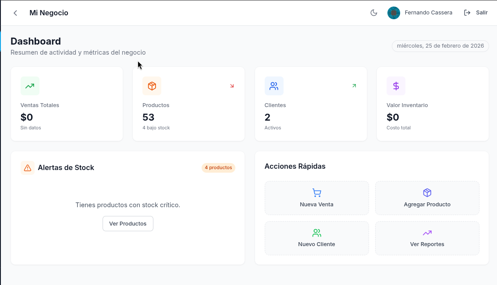

### Nueva Venta


### Comprobantes
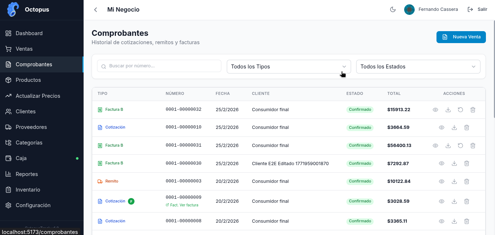

### Factura Electrónica (PDF)


### Cotización (PDF)
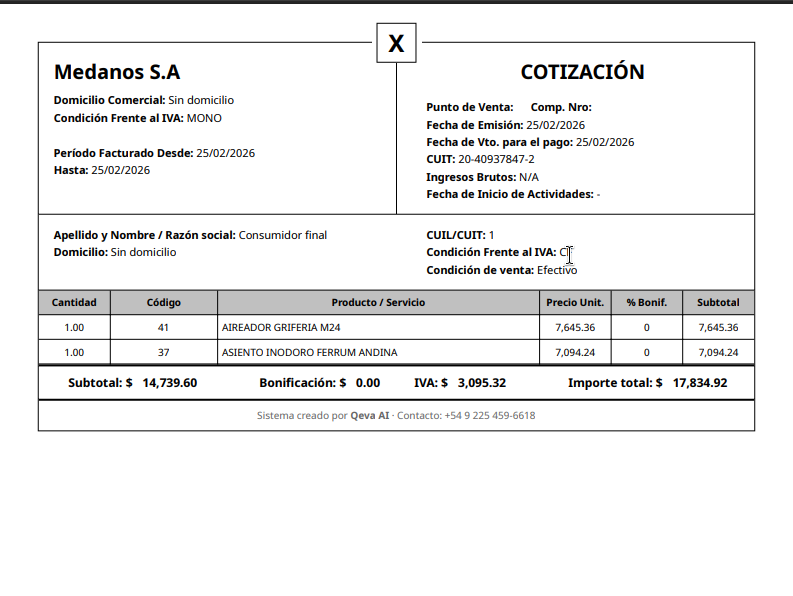

### Remito (PDF)


### Productos
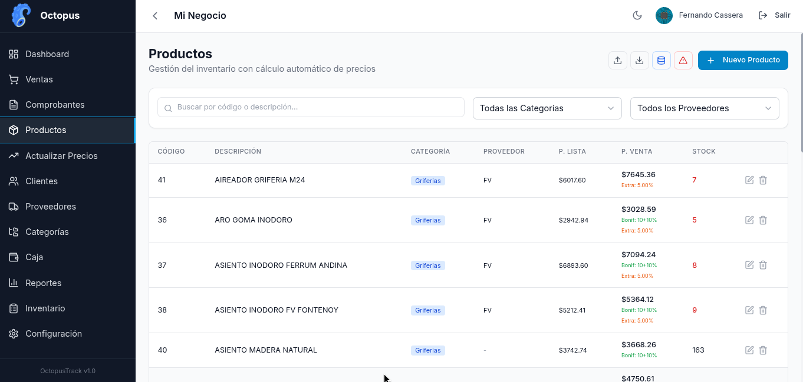

### Actualización Masiva de Precios
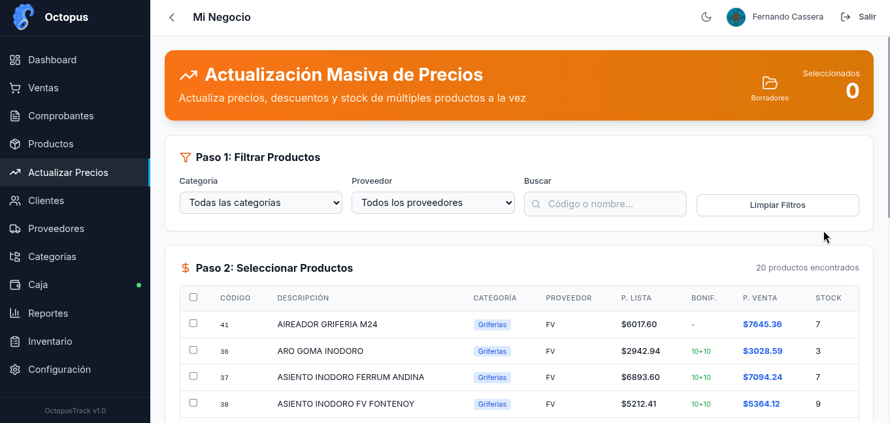

### Edición Masiva de Precios
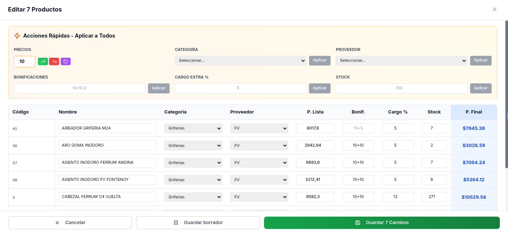

### Clientes
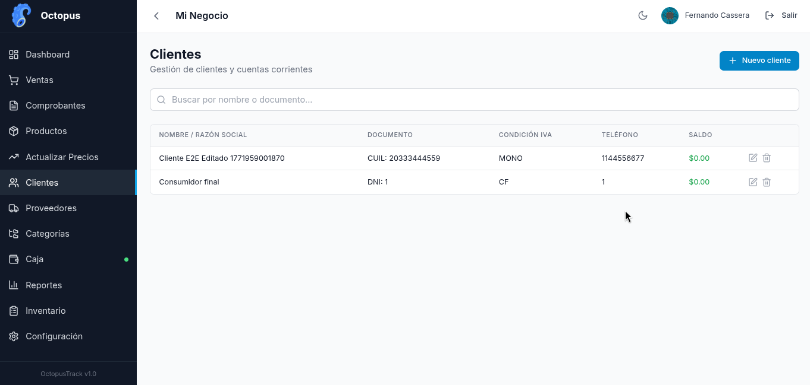

### Proveedores
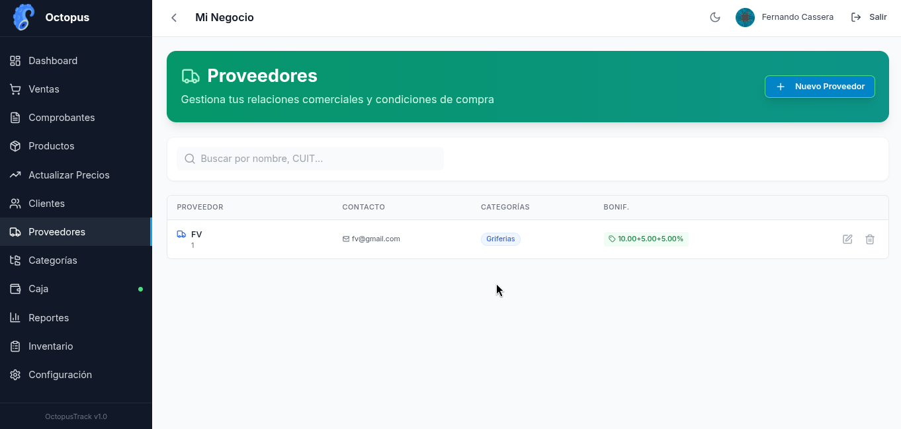

### Categorías
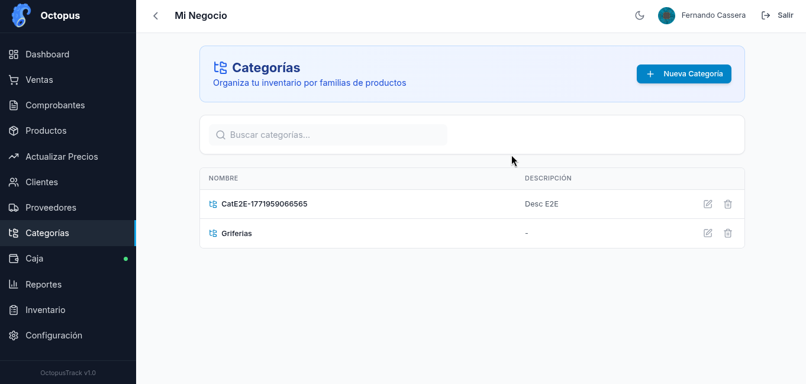

### Caja
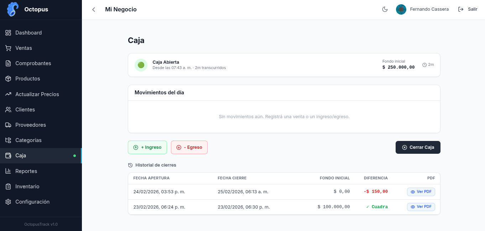

### Reportes
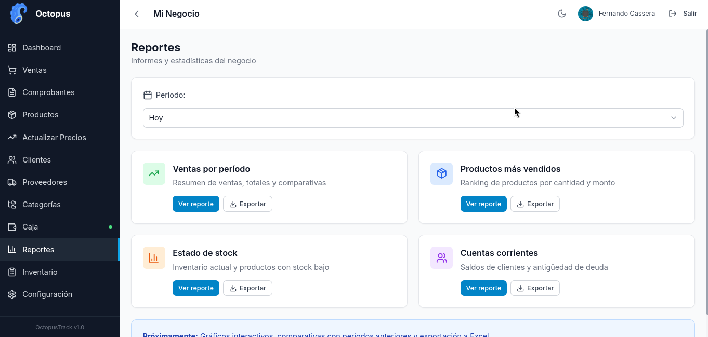

### Control de Inventario


### Orden de Pedido (PDF)
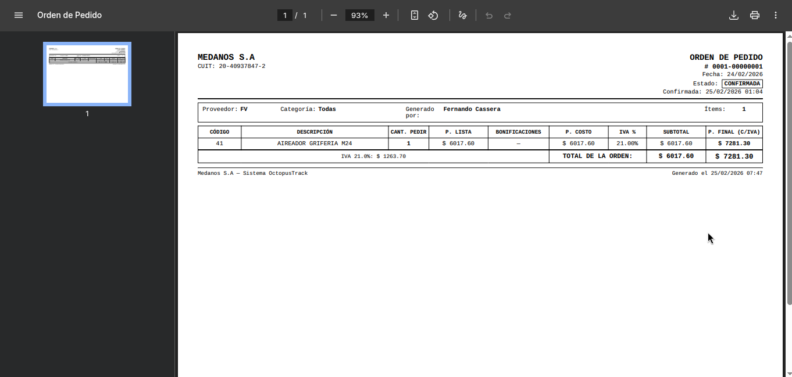

---

## Stack Tecnológico

### Backend
- **FastAPI** (Python 3.11+)
- **SQLAlchemy** (async) + **PostgreSQL**
- **Alembic** para migraciones
- **Pydantic** para validación
- **JWT** para autenticación

### Frontend
- **React 18** + **TypeScript**
- **TailwindCSS**
- **React Query** (TanStack Query)
- **Zustand** para estado global
- **React Router**

## Requisitos

- Docker y Docker Compose
- Node.js 20+ (para desarrollo local del frontend)
- Python 3.11+ (para desarrollo local del backend)

## Inicio Rápido

### Con Docker (recomendado)

```bash
# Clonar el repositorio
git clone <repo-url>
cd octopustrack

# Copiar archivo de variables de entorno
cp .env.example .env

# Iniciar todos los servicios
docker-compose up -d

# Ver logs
docker-compose logs -f
```

La aplicación estará disponible en:
- Frontend: http://localhost:5173
- Backend API: http://localhost:8000
- Documentación API: http://localhost:8000/docs

### Desarrollo Local

#### Backend

```bash
cd backend

# Crear entorno virtual
python -m venv venv
source venv/bin/activate  # Linux/Mac
# o: venv\Scripts\activate  # Windows

# Instalar dependencias
pip install -r requirements.txt

# Configurar variables de entorno
cp ../.env.example .env

# Ejecutar migraciones
alembic upgrade head

# Iniciar servidor
uvicorn app.main:app --reload
```

#### Frontend

```bash
cd frontend

# Instalar dependencias
npm install

# Iniciar servidor de desarrollo
npm run dev
```

## Estructura del Proyecto

```
octopustrack/
├── backend/
│   ├── app/
│   │   ├── main.py          # Entry point FastAPI
│   │   ├── config.py        # Configuración
│   │   ├── database.py      # Conexión PostgreSQL
│   │   ├── models/          # Modelos SQLAlchemy
│   │   ├── schemas/         # Schemas Pydantic
│   │   ├── routers/         # Endpoints API
│   │   ├── services/        # Lógica de negocio
│   │   └── utils/           # Utilidades
│   ├── alembic/             # Migraciones
│   └── requirements.txt
├── frontend/
│   ├── src/
│   │   ├── api/             # Cliente HTTP
│   │   ├── components/      # Componentes React
│   │   ├── pages/           # Páginas
│   │   ├── context/         # React Context
│   │   ├── stores/          # Zustand stores
│   │   └── types/           # TypeScript types
│   └── package.json
├── docker-compose.yml
├── .env.example
└── README.md
```

## API Endpoints

### Autenticación
- `POST /api/v1/auth/google` - Login con Google OAuth
- `POST /api/v1/auth/refresh` - Refrescar token
- `GET /api/v1/auth/me` - Usuario actual

### Productos
- `GET /api/v1/products` - Listar productos
- `POST /api/v1/products` - Crear producto
- `GET /api/v1/products/{id}` - Obtener producto
- `PUT /api/v1/products/{id}` - Actualizar producto
- `DELETE /api/v1/products/{id}` - Eliminar producto

### Clientes
- `GET /api/v1/clients` - Listar clientes
- `POST /api/v1/clients` - Crear cliente
- `GET /api/v1/clients/{id}` - Obtener cliente
- `PUT /api/v1/clients/{id}` - Actualizar cliente
- `DELETE /api/v1/clients/{id}` - Eliminar cliente

### Proveedores
- `GET /api/v1/suppliers` - Listar proveedores
- `POST /api/v1/suppliers` - Crear proveedor
- `GET /api/v1/suppliers/{id}` - Obtener proveedor
- `PUT /api/v1/suppliers/{id}` - Actualizar proveedor
- `DELETE /api/v1/suppliers/{id}` - Eliminar proveedor

### Categorías
- `GET /api/v1/categories` - Listar categorías
- `GET /api/v1/categories/tree` - Árbol de categorías
- `POST /api/v1/categories` - Crear categoría
- `PUT /api/v1/categories/{id}` - Actualizar categoría
- `DELETE /api/v1/categories/{id}` - Eliminar categoría

## Base de Datos

### Opción A — Migraciones Alembic (recomendado)

Si ya tenés PostgreSQL corriendo con la base de datos creada, aplicá todas las migraciones:

```bash
cd backend
source venv/bin/activate
alembic upgrade head
```

Esto crea las 20 tablas con todas las relaciones, índices y columnas en el orden correcto.

### Opción B — Script SQL directo

Si preferís crear el schema desde cero sin usar Alembic (por ejemplo para un entorno nuevo o para inspeccionar la estructura), usá el script incluido:

```bash
# Crear la base de datos (si no existe)
psql -U postgres -c "CREATE DATABASE octopustrack;"

# Aplicar el schema completo
psql -U postgres -d octopustrack -f database/schema.sql
```

El archivo `database/schema.sql` contiene la creación de las 20 tablas con todas las claves foráneas, índices y restricciones para PostgreSQL 13+.

### Tablas del sistema

| Tabla | Descripción |
|---|---|
| `users` | Usuarios del sistema (login Google OAuth) |
| `businesses` | Negocios (multi-tenant, uno por usuario) |
| `categories` | Categorías de productos |
| `suppliers` | Proveedores |
| `supplier_categories` | Relación proveedor ↔ categoría |
| `supplier_category_discounts` | Bonificaciones por proveedor/categoría |
| `products` | Productos con precios y stock |
| `price_history` | Historial de cambios de precio |
| `price_update_drafts` | Borradores de actualización masiva de precios |
| `clients` | Clientes |
| `client_accounts` | Cuenta corriente por cliente |
| `payment_methods` | Métodos de pago configurables |
| `vouchers` | Comprobantes (cotizaciones, remitos, facturas) |
| `voucher_items` | Líneas de cada comprobante |
| `voucher_payments` | Pagos asociados a cada comprobante |
| `payments` | Pagos de cuenta corriente |
| `cash_registers` | Cajas diarias |
| `cash_movements` | Movimientos de caja |
| `purchase_orders` | Órdenes de compra a proveedores |
| `purchase_order_items` | Líneas de cada orden de compra |

### Regenerar el script SQL

Si agregás nuevos modelos y necesitás actualizar el script:

```bash
cd backend
source venv/bin/activate
python scripts/generate_schema.py
```

## Variables de Entorno

Ver `.env.example` para la lista completa de variables.

## Roadmap

Funcionalidades planificadas para próximas versiones:

### 🤖 Agente de IA para Cotizaciones
Integración de un agente conversacional que permita generar cotizaciones mediante lenguaje natural. El usuario podrá describir lo que necesita ("necesito 3 caños de 1 pulgada y 2 llaves de paso") y el agente buscará los productos en el inventario, armará la cotización automáticamente y la dejará lista para confirmar o editar.

### 📄 OCR para Presupuestos de Proveedores
Carga de listas de precios y presupuestos de proveedores mediante foto o PDF. El sistema extraerá automáticamente los productos, códigos y precios usando OCR, y los comparará contra el inventario existente para actualizar precios o dar de alta productos nuevos.

### 📱 App Mobile
Versión mobile para consulta de stock, emisión de comprobantes y gestión de caja desde cualquier dispositivo.

### 📊 Dashboard Avanzado
Gráficos interactivos de ventas por período, comparativas con meses anteriores, ranking de productos más vendidos y proyecciones.

### 🔔 Notificaciones y Alertas
Alertas automáticas por stock crítico, vencimiento de CAE, facturas impagas y objetivos de venta.

### 👥 Jerarquía de Usuarios y Permisos
Sistema de roles y permisos dentro de cada negocio. Permitirá definir distintos niveles de acceso según el rol del operador:
- **Administrador**: acceso total al sistema, configuración y reportes
- **Vendedor**: solo puede emitir cotizaciones, remitos y facturas
- **Cajero**: acceso a caja y ventas, sin gestión de productos ni configuración
- **Repositor**: solo consulta y actualización de stock

### 🔗 Integraciones
- **MercadoLibre**: sincronización de stock y precios con publicaciones
- **WhatsApp**: envío de cotizaciones y facturas directamente al cliente
- **Bancos**: conciliación automática de transferencias con pagos registrados

---

## Licencia

Todos los derechos reservados.
