# OctopusTrack

Sistema ERP para gestión comercial de sanitarios, ferreterías y corralones.

## Descripción general

OctopusTrack hoy se organiza en **dos plataformas frontend** que comparten backend y base de datos:

- **Tenant app**: aplicación principal del negocio. Es el ERP que usa cada tenant para operar ventas, productos, clientes, caja, inventario y reportes.
- **Admin CMS**: panel de superadministración. Se usa para gestionar tenants, usuarios de plataforma y tareas administrativas/globales.

Ambas plataformas viven en el mismo proyecto `frontend/`, usan Vite con entradas separadas y consumen la misma API FastAPI.

## Plataformas actuales

### 1) Tenant app

Es la experiencia principal para cada negocio/tenant.

**Casos de uso principales:**
- ventas y comprobantes
- gestión de productos, clientes, proveedores y categorías
- caja diaria
- inventario
- reportes operativos

**Entry point frontend:** `frontend/tenant.html`

**Vista actual documentada:**

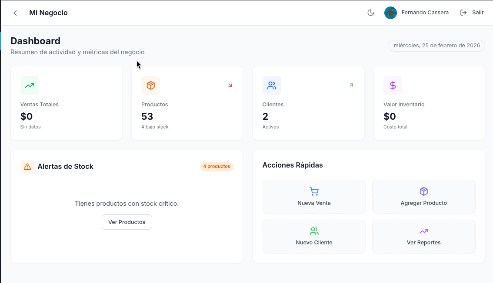

### 2) Admin CMS

Es el panel interno de superadministración de la plataforma.

**Casos de uso principales:**
- administración de tenants
- administración de usuarios de plataforma
- gestión operativa interna del entorno admin

**Entry point frontend:** `frontend/admin.html`

**¿Qué es el CMS y para qué se usa?**

El CMS admin es la consola interna de operación de OctopusTrack. No la usa el comercio final: la usa el equipo administrador para dar de alta y mantener tenants, gestionar usuarios de plataforma, revisar branding por tenant y configurar integraciones sensibles como ARCA/AFIP.

**Vista funcional hoy en código:**
- dashboard de superadministración
- listado y detalle de tenants
- gestión de usuarios
- configuración ARCA por tenant
- branding y acceso administrativo por tenant

> TODO: agregar captura real del CMS admin en `docs/screenshots/admin-cms-dashboard.png`.
>
> Estado actual: no existe todavía una imagen del CMS dentro del repo para referenciarla sin romper el README.

## Características principales

- **Gestión de productos** con cálculo automático de precios y bonificaciones
- **Clientes y cuenta corriente** con seguimiento de saldos
- **Proveedores** con condiciones comerciales
- **Ventas unificadas**: cotizaciones, remitos y facturas
- **Facturación electrónica** con integración ARCA
- **Reportes** de ventas, stock y cuentas corrientes
- **Caja diaria** con apertura, cierre y movimientos
- **Tema claro/oscuro**

## Arquitectura actual

```text
┌───────────────────────────── Frontend ─────────────────────────────┐
│                                                                    │
│  Tenant app (Vite + React)        Admin CMS (Vite + React)         │
│  - tenant.html                    - admin.html                     │
│  - puerto dev 5173                - puerto dev 5174                │
│                                                                    │
└───────────────────────────┬────────────────────────────────────────┘
                            │ REST API / JSON
┌───────────────────────────▼────────────────────────────────────────┐
│                        Backend (FastAPI)                           │
│  Auth · Productos · Clientes · Proveedores · Caja · PDF · ARCA    │
└───────────────────────────┬────────────────────────────────────────┘
                            │
                    ┌───────▼────────┐
                    │   PostgreSQL   │
                    └────────────────┘
```

### Distribución por capas

- **Frontend tenant**: experiencia ERP del negocio.
- **Frontend admin**: consola de superadmin para operación de plataforma.
- **Backend**: API central, autenticación, lógica de negocio, generación de PDFs e integración ARCA.
- **Base de datos**: persistencia multi-tenant en PostgreSQL.

## Stack tecnológico

### Backend
- **FastAPI** (Python 3.11+)
- **SQLAlchemy async** + **PostgreSQL**
- **Alembic** para migraciones
- **Pydantic** para validación
- **JWT** para autenticación

### Frontend
- **React 18** + **TypeScript**
- **Vite** con entradas múltiples (`tenant.html` y `admin.html`)
- **TailwindCSS**
- **TanStack Query**
- **Zustand**
- **React Router**

## Requisitos

- Docker y Docker Compose
- Node.js 20+ (desarrollo frontend)
- Python 3.11+ (desarrollo backend)

## Getting Started

### Opción 1 — Docker

```bash
# Clonar el repositorio
git clone <repo-url>
cd 18-OctopusTrack

# Copiar variables de entorno
cp .env.example .env

# Levantar servicios
docker-compose up -d

# Ver logs
docker-compose logs -f
```

Servicios esperados:

- Backend API: http://localhost:8000
- Documentación API: http://localhost:8000/docs

> Nota: el README documenta con más detalle el flujo de desarrollo local del frontend porque hoy existen dos apps separadas (tenant y admin).

### Opción 2 — Desarrollo local

#### Backend

```bash
cd backend

# Crear entorno virtual
python -m venv venv
source venv/bin/activate  # Linux/Mac
# o: venv\Scripts\activate  # Windows

# Instalar dependencias
pip install -r requirements.txt

# Configurar variables de entorno
cp ../.env.example .env

# Ejecutar migraciones
alembic upgrade head

# Iniciar servidor
uvicorn app.main:app --reload
```

Backend local:

- API: http://localhost:8000
- Swagger: http://localhost:8000/docs

#### Frontend

```bash
cd frontend

# Instalar dependencias
npm install
```

##### Tenant app

```bash
npm run dev:tenant
```

- Script validado en `frontend/package.json`
- Puerto esperado: **5173**
- URL esperada: `http://localhost:5173/tenant.html`

##### Admin CMS

```bash
npm run dev:admin
```

- Script validado en `frontend/package.json`
- Puerto esperado: **5174**
- URL esperada: `http://localhost:5174/admin.html`

##### ¿Se pueden correr en paralelo?

Sí. Los dos scripts usan **puertos distintos** y pueden ejecutarse al mismo tiempo:

- `dev:tenant` → `5173`
- `dev:admin` → `5174`

Además, ambos usan `--strictPort`, así que si el puerto está ocupado **Vite falla** en vez de moverse a otro puerto automáticamente.

## Scripts de desarrollo del frontend

Scripts relevantes validados contra `frontend/package.json`:

```bash
npm run dev          # alias de dev:tenant
npm run dev:tenant   # tenant app
npm run dev:admin    # admin CMS
npm run build
npm run build:tenant
npm run build:admin
npm run lint
npm run preview
```

## Estructura del proyecto

```text
18-OctopusTrack/
├── backend/
│   ├── app/
│   │   ├── main.py
│   │   ├── config.py
│   │   ├── database.py
│   │   ├── models/
│   │   ├── schemas/
│   │   ├── routers/
│   │   ├── services/
│   │   └── utils/
│   ├── alembic/
│   └── requirements.txt
├── frontend/
│   ├── admin.html                # entrada del Admin CMS
│   ├── tenant.html               # entrada de la Tenant app
│   ├── vite.config.ts
│   ├── package.json
│   └── src/
│       ├── admin/                # app de superadministración
│       ├── tenant/               # app ERP del negocio
│       ├── api/                  # cliente HTTP y servicios
│       ├── components/           # componentes compartidos
│       ├── context/
│       ├── hooks/
│       ├── pages/
│       ├── stores/
│       ├── styles/
│       └── types/
├── docker-compose.yml
├── .env.example
└── README.md
```

## Arquitectura del agente IA

<picture>
  <source type="image/svg+xml" srcset="docs/diagrams/ai-agent-architecture-min.svg">
  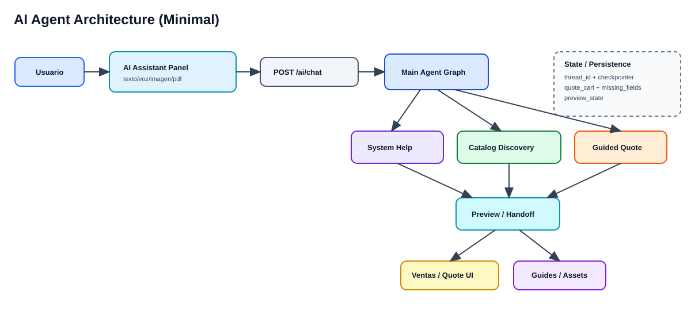
</picture>

### Subgrafos detallados

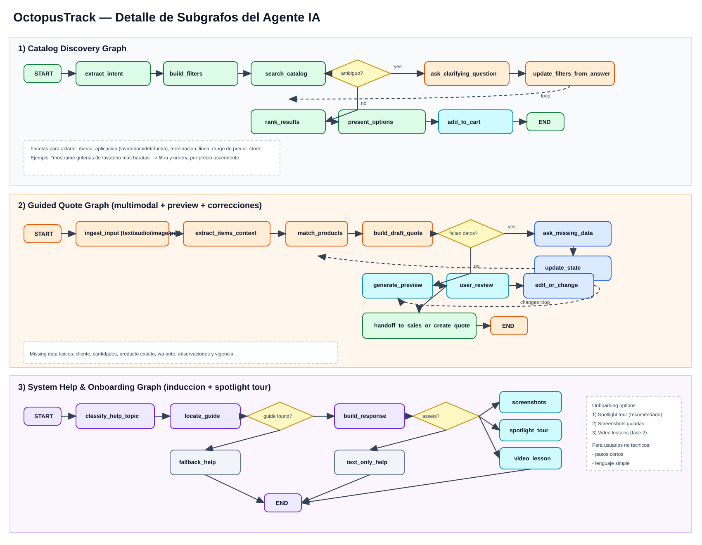

El asistente IA usa una arquitectura LangGraph con un grafo principal y subgrafos especializados:

- **Main Agent Graph**: orquesta el enrutamiento según intención.
- **Catalog Discovery Graph**: búsqueda guiada con preguntas aclaratorias.
- **Guided Quote Graph**: intake multimodal, detección de faltantes y preview editable.
- **System Help & Onboarding Graph**: ayuda operativa del sistema y guías visuales.

Fuente editable del diagrama: `docs/diagrams/ai-agent-architecture.drawio`

## Testing E2E (TestSprite)

Guía de ejecución local y bypass de login para pruebas automatizadas:

- `testsprite_tests/README.md`

## Capturas del sistema

Las siguientes capturas corresponden a la **tenant app** (ERP operativo del negocio). El **CMS admin** quedó documentado arriba con su explicación funcional y con TODO explícito de screenshot pendiente.

### Dashboard


### Nueva Venta
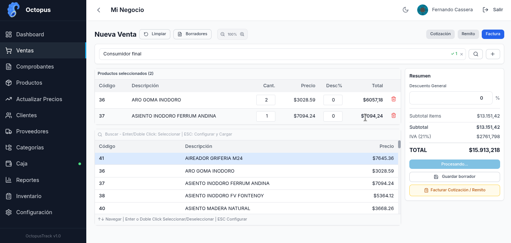

### Comprobantes
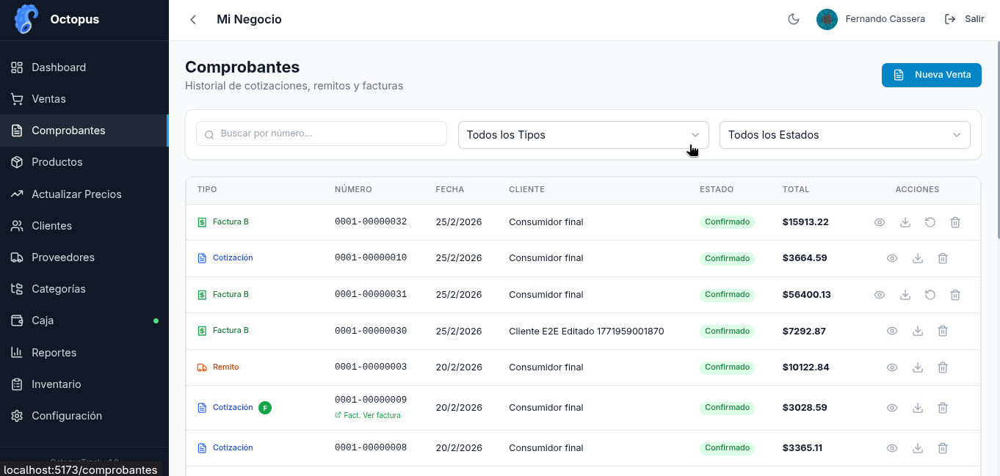

### Factura Electrónica (PDF)
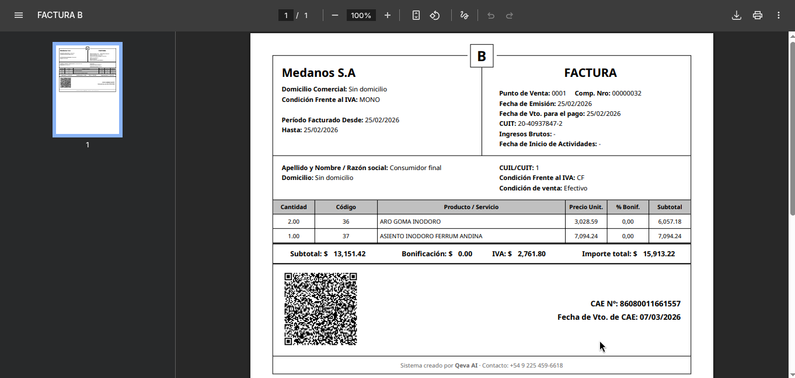

### Cotización (PDF)
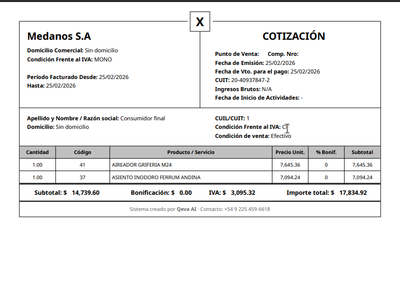

### Remito (PDF)
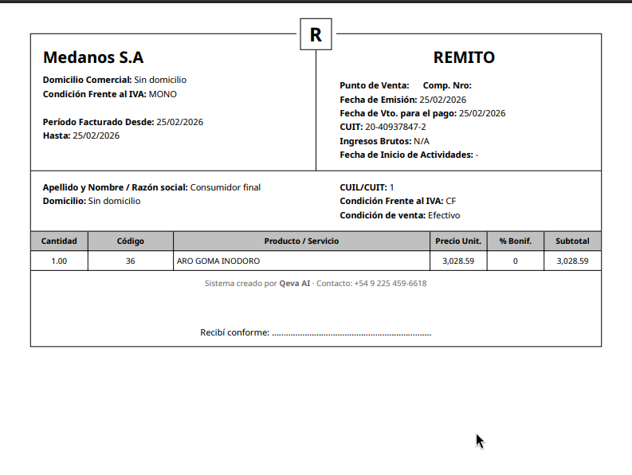

### Productos
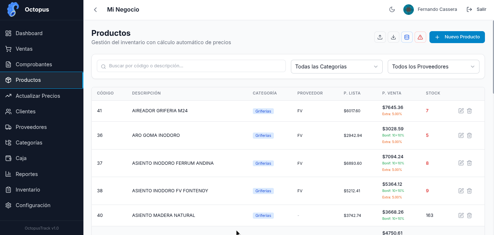

### Actualización Masiva de Precios
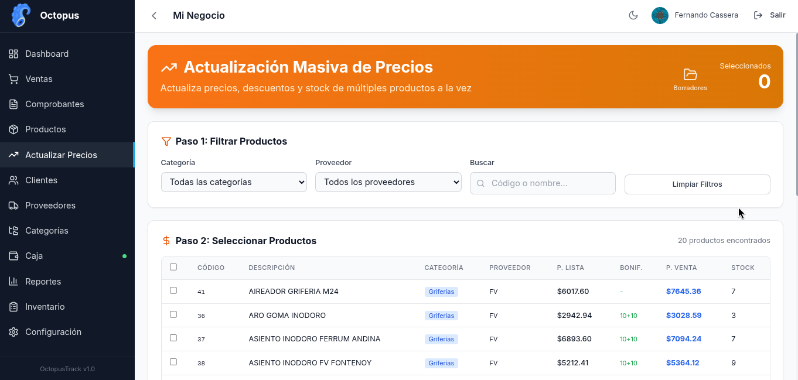

### Edición Masiva de Precios
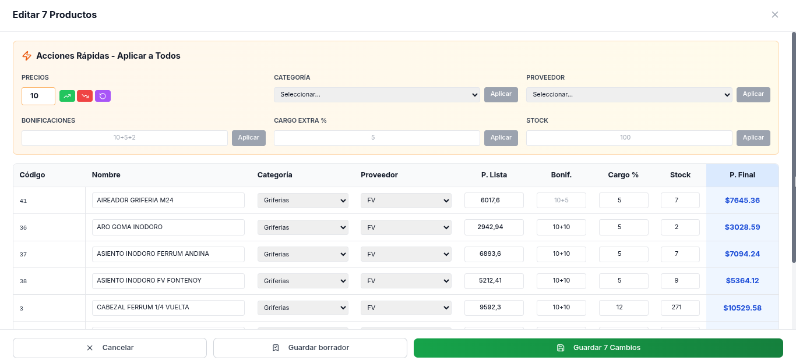

### Clientes
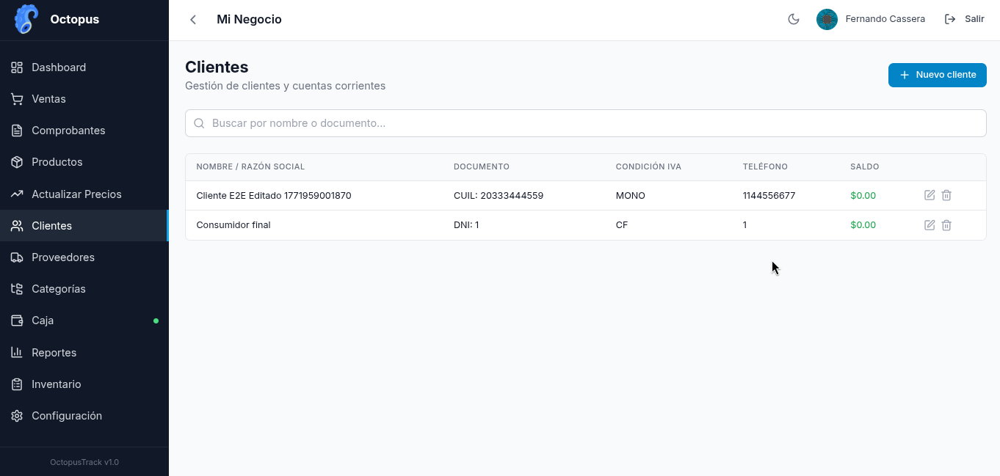

### Proveedores
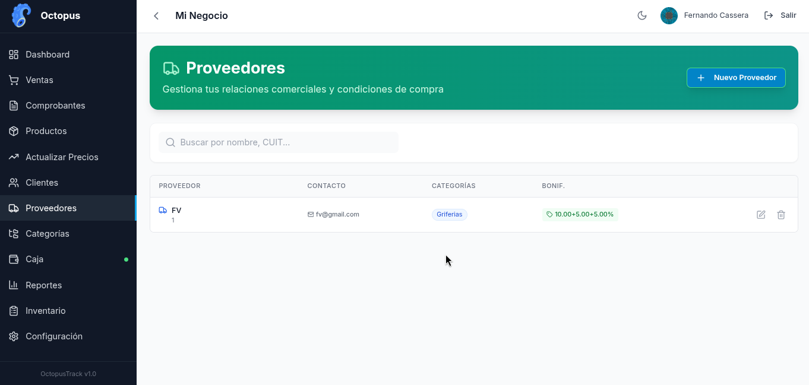

### Categorías
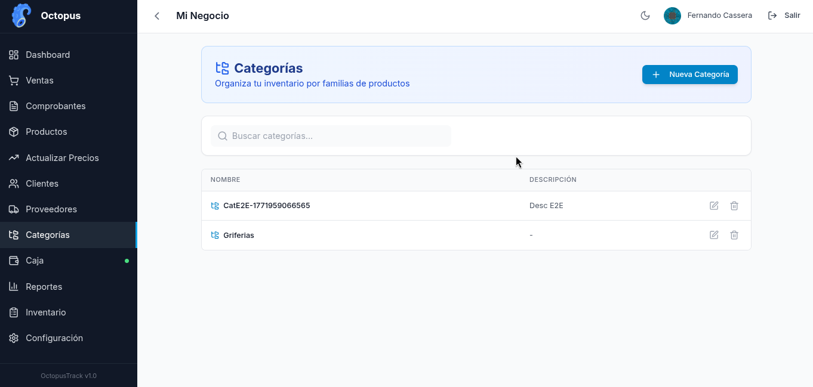

### Caja
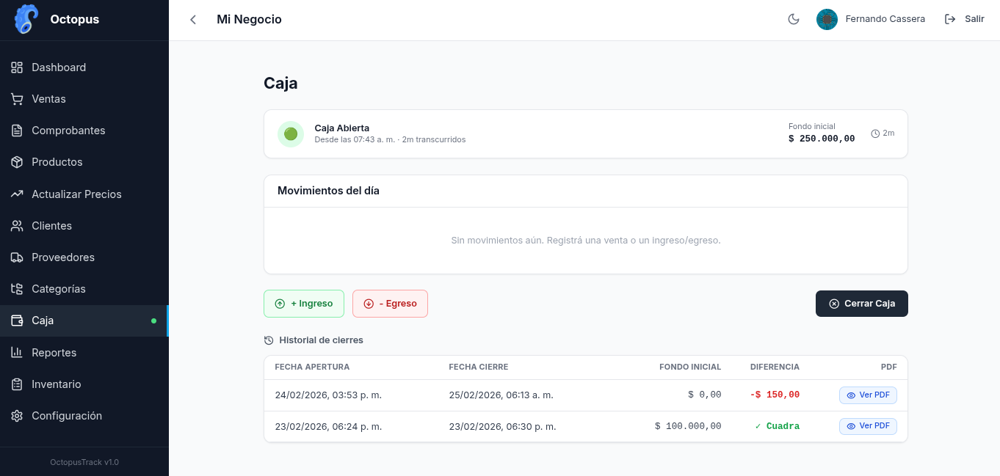

### Reportes
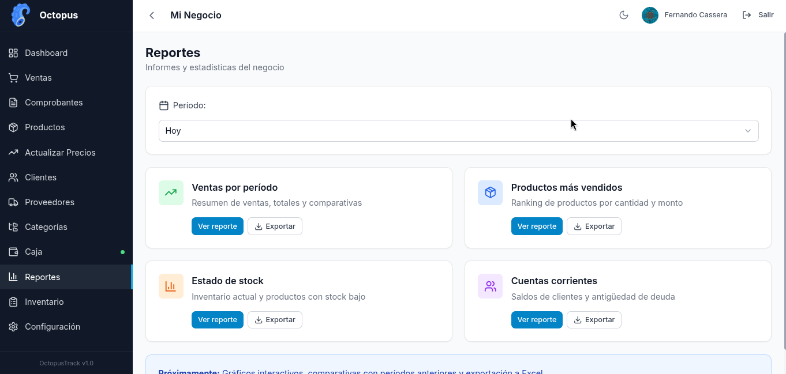

### Control de Inventario
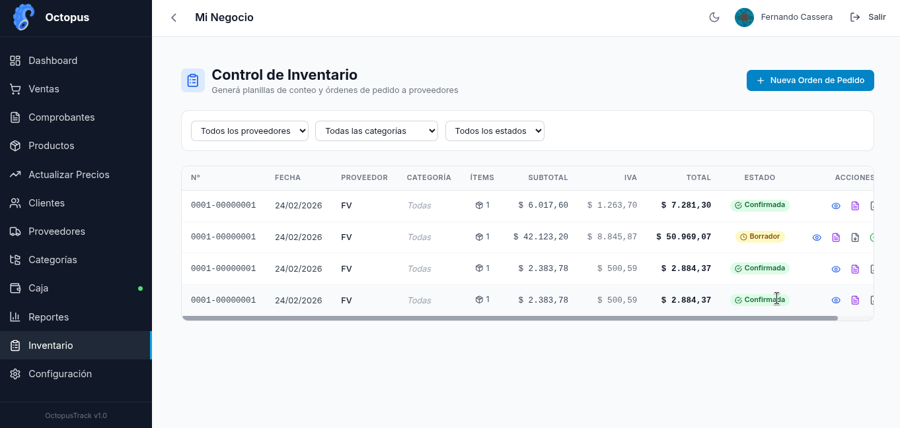

### Orden de Pedido (PDF)
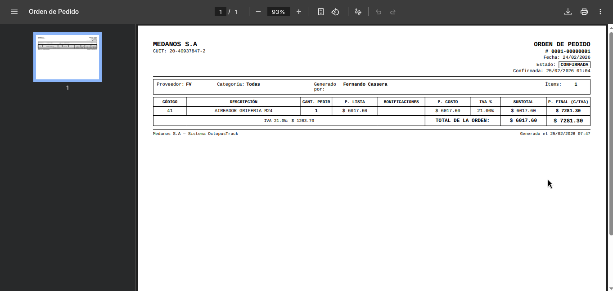

## API endpoints

### Autenticación
- `POST /api/v1/auth/google` - Login con Google OAuth
- `POST /api/v1/auth/refresh` - Refrescar token
- `GET /api/v1/auth/me` - Usuario actual

### Productos
- `GET /api/v1/products` - Listar productos
- `POST /api/v1/products` - Crear producto
- `GET /api/v1/products/{id}` - Obtener producto
- `PUT /api/v1/products/{id}` - Actualizar producto
- `DELETE /api/v1/products/{id}` - Eliminar producto

### Clientes
- `GET /api/v1/clients` - Listar clientes
- `POST /api/v1/clients` - Crear cliente
- `GET /api/v1/clients/{id}` - Obtener cliente
- `PUT /api/v1/clients/{id}` - Actualizar cliente
- `DELETE /api/v1/clients/{id}` - Eliminar cliente

### Proveedores
- `GET /api/v1/suppliers` - Listar proveedores
- `POST /api/v1/suppliers` - Crear proveedor
- `GET /api/v1/suppliers/{id}` - Obtener proveedor
- `PUT /api/v1/suppliers/{id}` - Actualizar proveedor
- `DELETE /api/v1/suppliers/{id}` - Eliminar proveedor

### Categorías
- `GET /api/v1/categories` - Listar categorías
- `GET /api/v1/categories/tree` - Árbol de categorías
- `POST /api/v1/categories` - Crear categoría
- `PUT /api/v1/categories/{id}` - Actualizar categoría
- `DELETE /api/v1/categories/{id}` - Eliminar categoría

## Base de datos

### Opción A — Migraciones Alembic

```bash
cd backend
source venv/bin/activate
alembic upgrade head
```

### Opción B — Script SQL directo

```bash
# Crear la base de datos (si no existe)
psql -U postgres -c "CREATE DATABASE octopustrack;"

# Aplicar el schema completo
psql -U postgres -d octopustrack -f database/schema.sql
```

### Tablas del sistema

| Tabla | Descripción |
|---|---|
| `users` | Usuarios del sistema |
| `businesses` | Negocios / tenants |
| `categories` | Categorías de productos |
| `suppliers` | Proveedores |
| `supplier_categories` | Relación proveedor ↔ categoría |
| `supplier_category_discounts` | Bonificaciones por proveedor/categoría |
| `products` | Productos con precios y stock |
| `price_history` | Historial de cambios de precio |
| `price_update_drafts` | Borradores de actualización masiva de precios |
| `clients` | Clientes |
| `client_accounts` | Cuenta corriente por cliente |
| `payment_methods` | Métodos de pago configurables |
| `vouchers` | Comprobantes |
| `voucher_items` | Líneas de cada comprobante |
| `voucher_payments` | Pagos asociados a cada comprobante |
| `payments` | Pagos de cuenta corriente |
| `cash_registers` | Cajas diarias |
| `cash_movements` | Movimientos de caja |
| `purchase_orders` | Órdenes de compra |
| `purchase_order_items` | Líneas de cada orden |

## Variables de entorno

Ver `.env.example` para la lista completa de variables.

## Roadmap

Funcionalidades planificadas para próximas versiones:

### 🤖 Agente de IA para Cotizaciones
Integración de un agente conversacional para generar cotizaciones mediante lenguaje natural.

### 📄 OCR para Presupuestos de Proveedores
Carga de listas de precios y presupuestos mediante foto o PDF con extracción automática.

### 📱 App Mobile
Versión mobile para consulta de stock, emisión de comprobantes y gestión de caja.

### 📊 Dashboard Avanzado
Gráficos interactivos de ventas, comparativas y proyecciones.

### 🔔 Notificaciones y Alertas
Alertas automáticas por stock crítico, vencimiento de CAE y facturas impagas.

### 👥 Jerarquía de Usuarios y Permisos
Sistema de roles y permisos dentro de cada negocio.

### 🔗 Integraciones
- MercadoLibre
- WhatsApp
- Bancos

## Licencia

Todos los derechos reservados.
