<p align="center">
  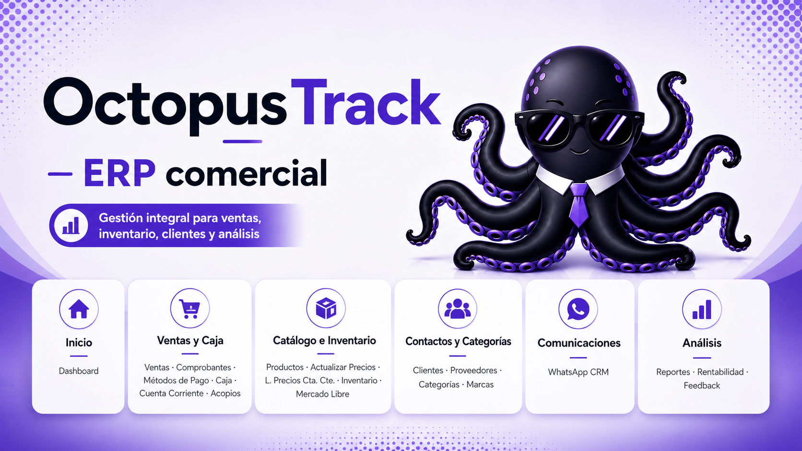
</p>

# OctopusTrack

ERP comercial para sanitarios, ferreterías y corralones. Ventas, facturación electrónica ARCA, stock, cuenta corriente y rentabilidad, todo en un solo sistema.

---

## Probar el sistema

**Demo online:** https://app.octopustrack.shop

Solicitá acceso de prueba por WhatsApp: [+54 9 2254 59-6618](https://wa.me/5492254596618)

> Al ingresar, pedí habilitación por WhatsApp para activar la prueba.

---

## Qué tiene hoy

| Módulo | Qué hace |
|--------|----------|
| **Ventas y comprobantes** | Cotizaciones, remitos y facturas electrónicas ARCA; conversión entre tipos en un click |
| **Catálogo y precios** | ABM de productos con precio lista, bonificaciones, cargo extra, ganancia e IVA; actualización masiva |
| **Inventario** | Órdenes de pedido por proveedor, control de stock, reportes exportables en PDF |
| **Caja diaria** | Registro de movimientos reales de caja, apertura y cierre por turno |
| **Cuenta Corriente** | Saldo por cliente; el titular puede autorizar retiro a un subcliente (p. ej. arquitecto → plomero) |
| **Acopios** | Anticipos de clientes para obras; seguimiento de importe retirado y saldo disponible |
| **Listas de precios** | Snapshot del catálogo para compartir con clientes en cuenta corriente |
| **Métodos de pago** | Configuración de medios de cobro: efectivo, cheque, débito, crédito, MP, transferencia |
| **Rentabilidad** | KPIs de margen bruto, margen neto, COGS y gastos operativos por período |
| **Mercado Libre** | Publicación y sincronización de precios y stock via OAuth + webhook |
| **Agente IA** | Consulta de precios por lenguaje natural y asistencia para armar cotizaciones |
| **Soporte** | Feedback desde el sistema, integrado con Linear App para gestión de tickets |

---

## Capturas del sistema

### Login
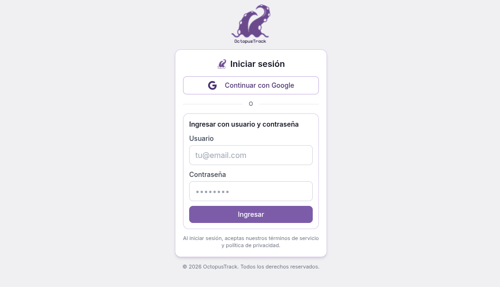

### Dashboard
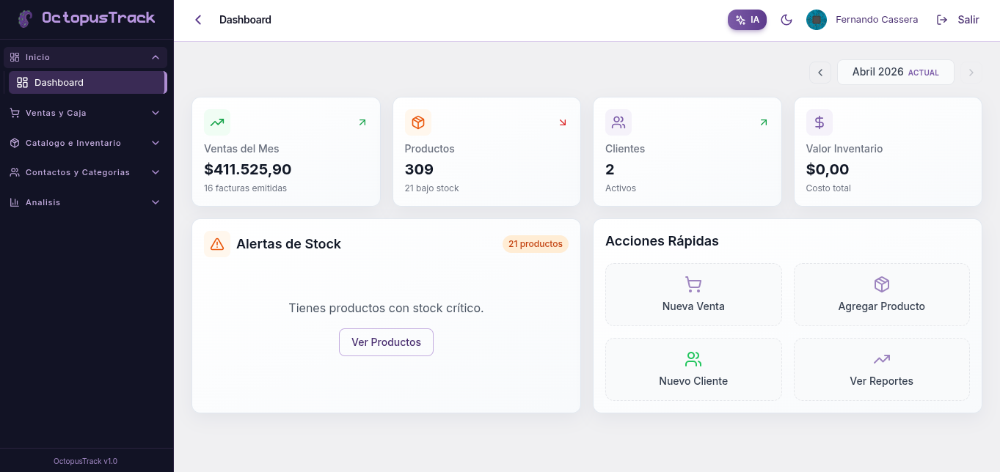

### Ventas — Nuevo comprobante
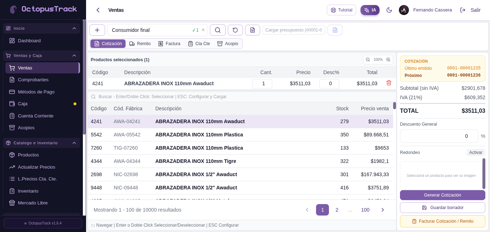

### Comprobantes
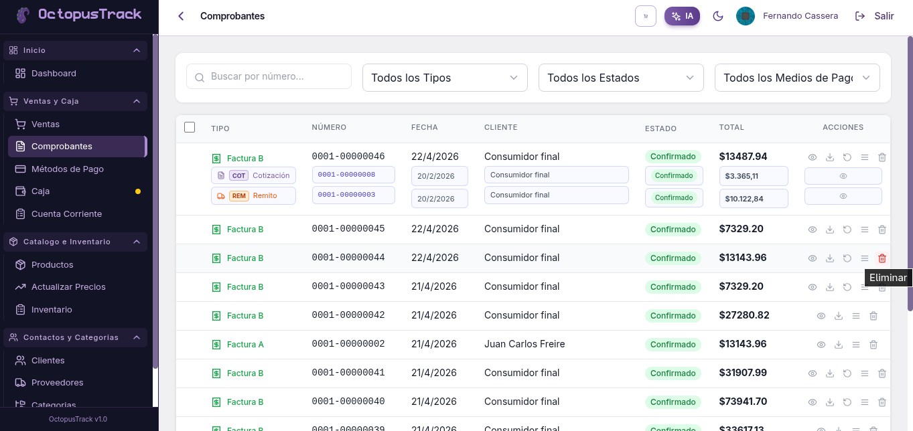

### Productos
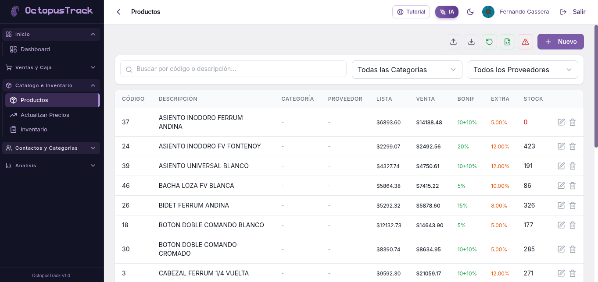

### Nuevo Producto
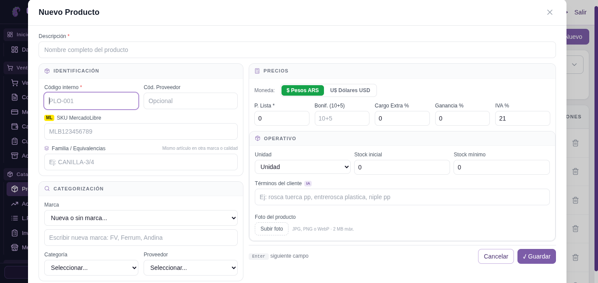

### Actualizar Precios
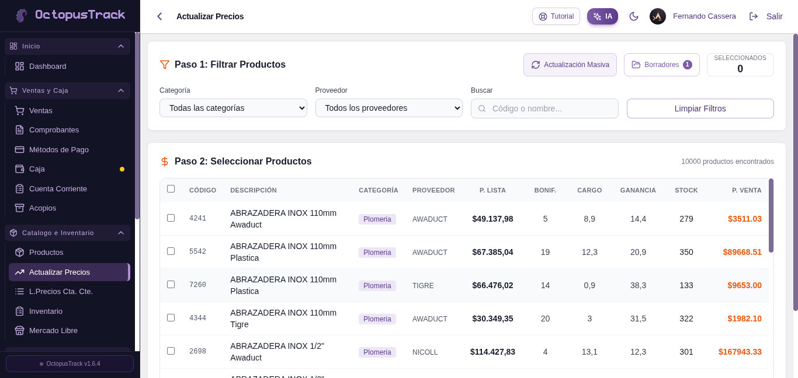

### Listas de Precios — Cuenta Corriente
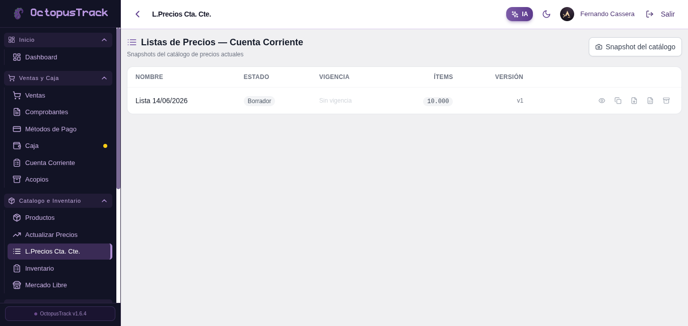

### Inventario
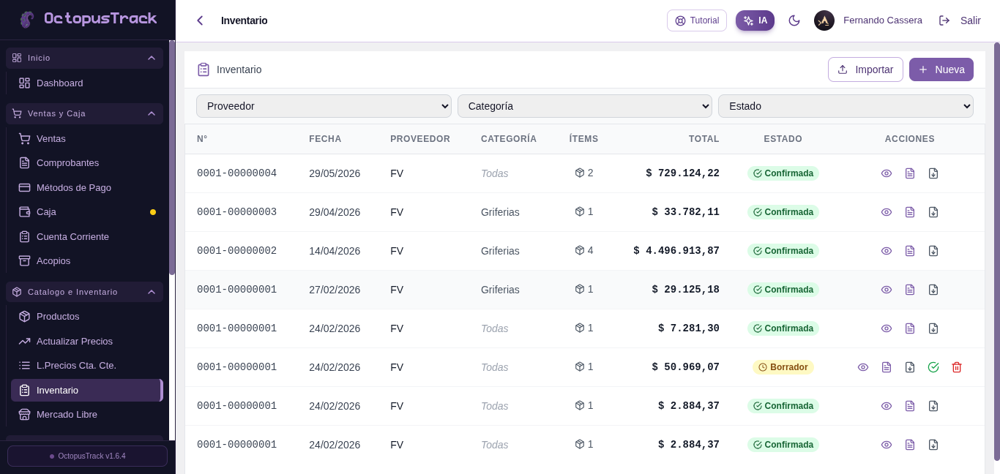

### Caja Diaria
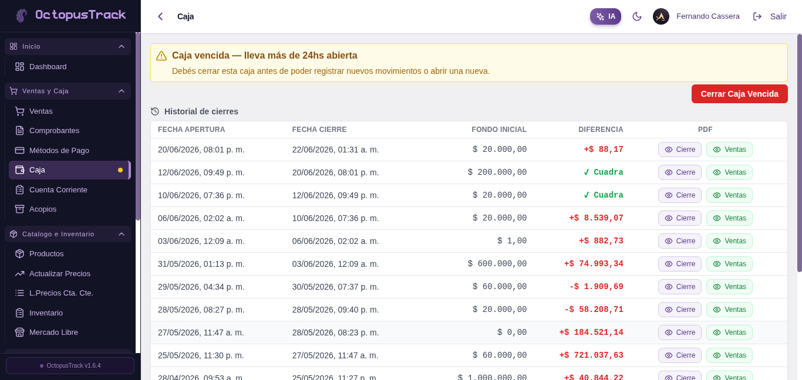

### Cuenta Corriente
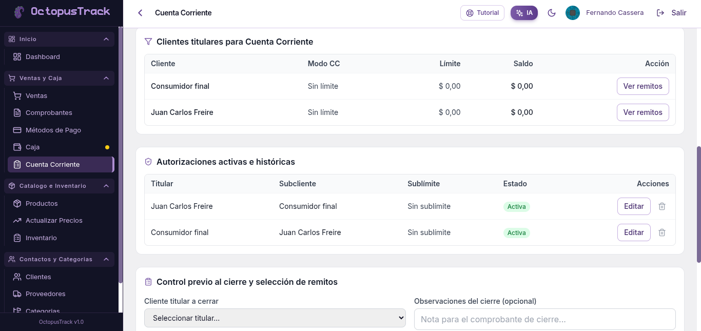

### Acopios
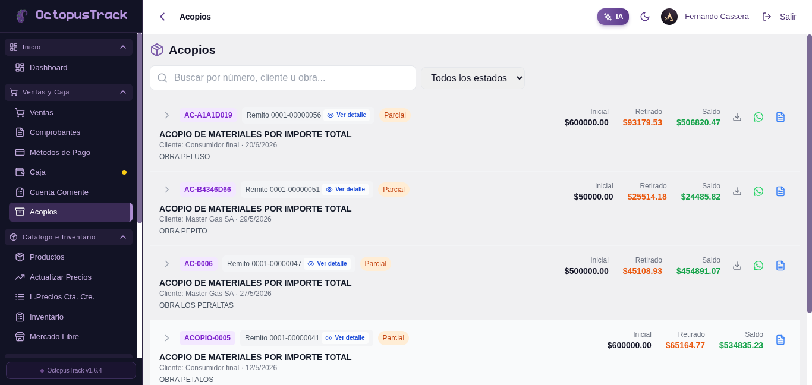

### Métodos de Pago
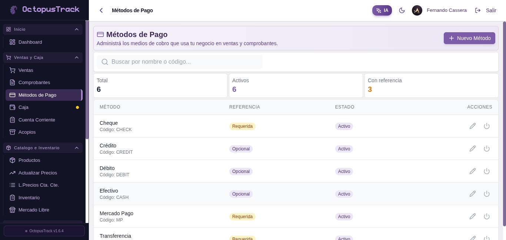

### Mercado Libre
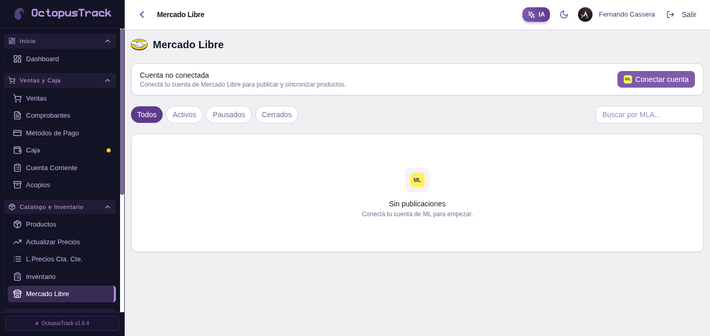

### PDF — Cotización
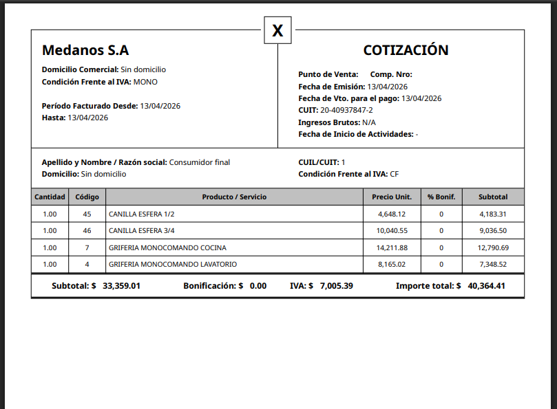

### PDF — Remito
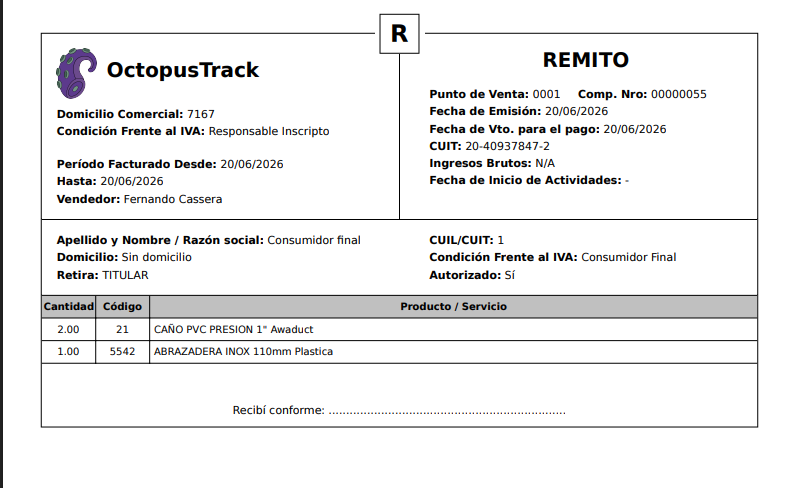

### PDF — Factura B (ARCA)
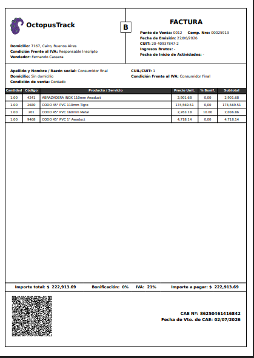

### PDF — Orden de Pedido
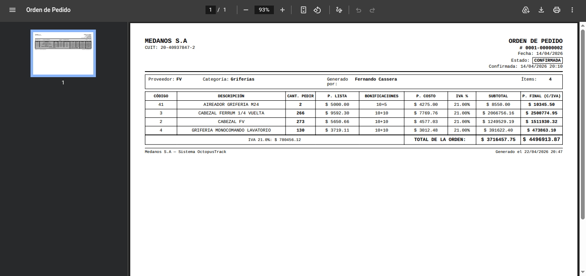

---

## Integración Mercado Libre

OctopusTrack puede conectarse a una cuenta de Mercado Libre para publicar productos del inventario y sincronizar precios y stock automáticamente.

### Requisitos previos

1. Crear una aplicación en el [DevCenter de ML](https://developers.mercadolibre.com.ar/devcenter):
   - **Redirect URI**: `https://<tu-dominio>/api/v1/meli/oauth/callback`
   - Activar el topic **`orders_v2`** en Notifications con URL: `https://<tu-dominio>/api/v1/meli/notifications`
   - Anotar **App ID** (client_id) y **Secret Key** (client_secret)

2. Generar una clave Fernet para cifrar los tokens en la base de datos:
   ```bash
   python -c "from cryptography.fernet import Fernet; print(Fernet.generate_key().decode())"
   ```

### Variables de entorno

Agregar al `.env` del backend:

```env
MELI_CLIENT_ID=<App ID del DevCenter>
MELI_CLIENT_SECRET=<Secret Key del DevCenter>
MELI_REDIRECT_URI=https://<tu-dominio>/api/v1/meli/oauth/callback
MELI_SITE_ID=MLA
MELI_API_BASE=https://api.mercadolibre.com
MELI_AUTH_BASE=https://auth.mercadolibre.com.ar
MELI_TOKEN_ENCRYPTION_KEY=<clave Fernet generada arriba>
```

### Arquitectura de la sincronización

```
Cambio local (precio/stock)
  └─► meli_sync_queue (outbox)
         └─► SyncWorker (asyncio, cada 5 s)
                └─► PUT /items/{id} en ML

Webhook ML (orders_v2)
  └─► POST /api/v1/meli/notifications → 200 inmediato
         └─► job process_order en meli_sync_queue
                └─► GET /orders/{id} → FIFO consume stock local
```

- Los tokens se guardan cifrados con Fernet, por negocio.
- El refresh_token es de un solo uso; se rota atómicamente con `SELECT … FOR UPDATE`.
- Los webhooks se procesan con idempotencia por `meli_order_id`.

### Usuarios de prueba (desarrollo)

ML permite crear sellers y compradores de prueba desde el DevCenter → *Usuarios de prueba*. Con esos usuarios podés hacer el flujo completo (OAuth, publicar, webhook de venta) sin afectar cuentas reales.

---

## Colaboración

Este proyecto está en crecimiento constante. Si querés colaborar con ideas, feedback funcional o mejoras:

- Abrí un issue en este repositorio
- O escribinos por [WhatsApp](https://wa.me/5492254596618) para coordinar una prueba guiada

---

**OctopusTrack** — evolución constante para negocios que necesitan velocidad, control y orden comercial real.
