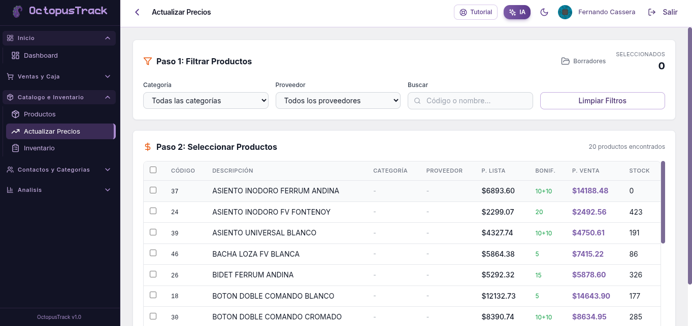
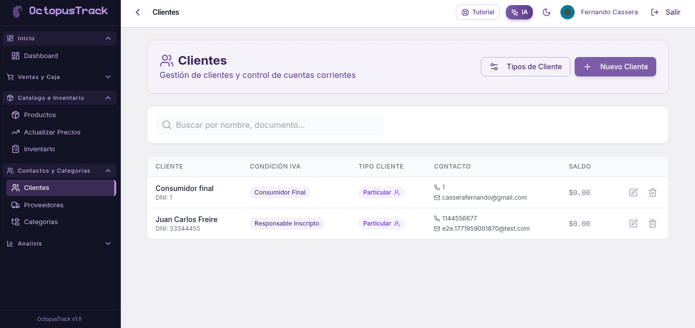
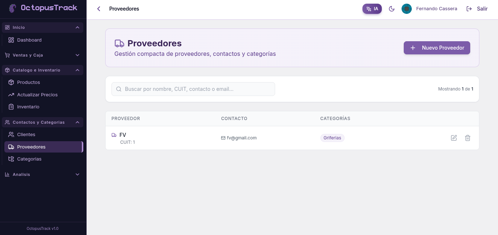
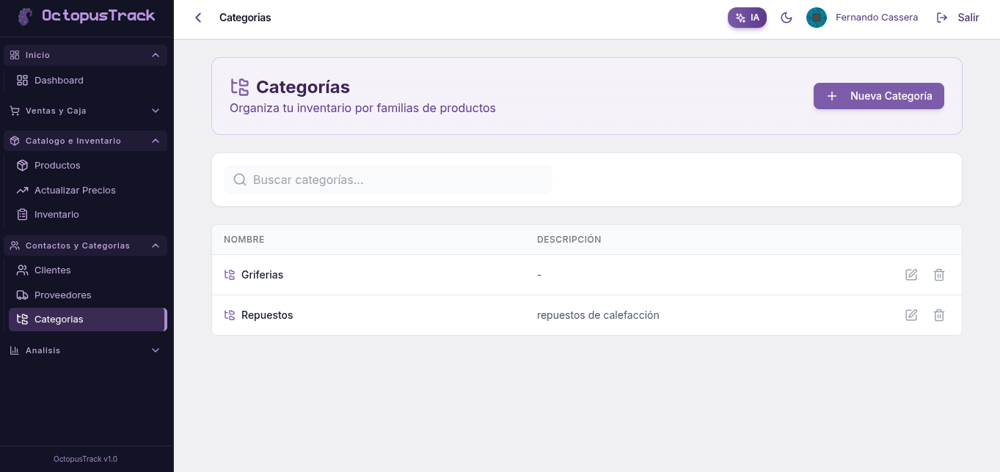
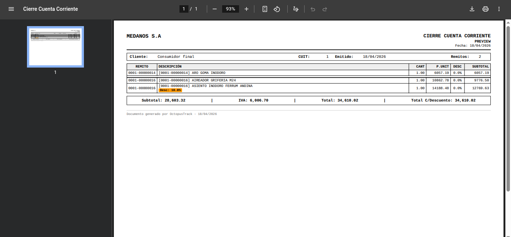
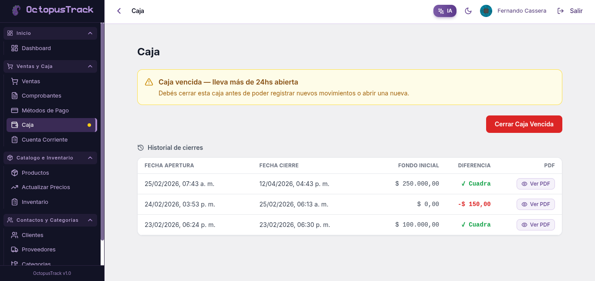
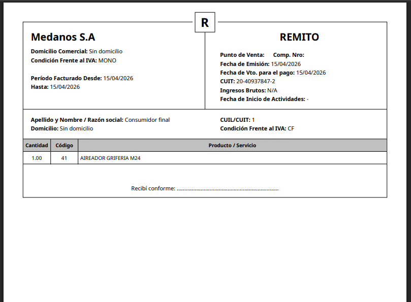
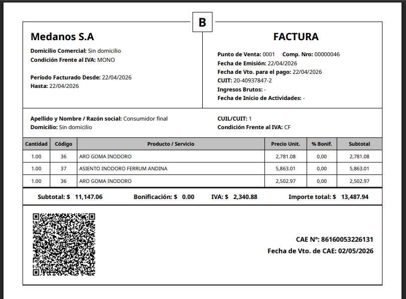

# 🐙 OctopusTrack

Sistema ERP para sanitarios, ferreterías y corralones.

---

## 🚀 Probar el sistema

🌐 **Demo online:** https://octopus.qeva.xyz

📲 **Acceso de prueba con autorización previa por WhatsApp:**

- WhatsApp: **+54 9 2254 59-6618**
- Link directo: https://wa.me/5492254596618

> Al ingresar, solicitá acceso por WhatsApp para habilitar la prueba.

---

## ✨ ¿Qué tiene hoy OctopusTrack? (paso a paso)

1. 🧾 **Cotizaciones**
   - Creación rápida de presupuestos.
   - Conversión posterior a remito o factura.

2. 🧷 **Remitos con y sin precios**
   - Emisión de remitos según necesidad operativa.
   - Ideal para entrega con control comercial.

3. 🧮 **Facturación electrónica ARCA (vía AFIP SDK)**
   - Emisión de comprobantes fiscales.
   - Flujo integrado con datos fiscales del sistema.

4. 💸 **Actualización masiva de precios**
   - Herramientas para modificar grandes volúmenes de productos.
   - Pensado para rubros con listas cambiantes.

5. 🤝 **Cuenta corriente por cliente**
   - Gestión de saldo, movimientos y seguimiento comercial.

6. 🏗️ **Cuenta corriente + retiro autorizado de mercadería**
   - Un cliente titular puede autorizar a otro cliente a retirar mercadería.
   - Caso real: arquitecto titular + instalador/plomero/electricista autorizado.

7. 💳 **Métodos de pago**
   - Configuración de métodos y registro operativo.

8. 👥 **Clientes y proveedores**
   - Gestión completa de contactos comerciales.

9. 🤖 **Agente de IA**
   - Consulta de precios por lenguaje natural.
   - Asistencia para crear cotizaciones.
   - Módulo en evolución continua para nuevas mejoras.

10. 📦 **Inventario y stock**
    - Control de stock y conteo.
    - Reportes para contabilizar mercadería.
    - Reportes exportables para compartir con proveedores.

11. 📊 **Área de reportes**
    - Reportes operativos del negocio para análisis diario.

12. 🛟 **Soporte y seguimiento de incidencias**
    - El usuario puede enviar feedback/problemas desde el sistema.
    - El mensaje se integra con **Linear App** para gestión de tickets.

---

## 🖼️ Capturas del sistema

### Login

### Dashboard

### Productos

### Actualización Masiva de Precios

### Clientes

### Proveedores

### Categorías

### Comprobantes

### Cuenta Corriente

### Resumen Cuenta Corriente

### Caja

### Métodos de Pago

### Inventario

### PDF — Cotización

### PDF — Remito

### PDF — Factura

### PDF — Inventario

---

## 💜 Colaboración

Este proyecto está en crecimiento constante.

Si querés colaborar con ideas, feedback funcional o mejoras:

- abrí un issue
- o escribinos por WhatsApp para coordinar una prueba guiada

---

**OctopusTrack** — evolución constante para negocios que necesitan velocidad, control y orden comercial real.
